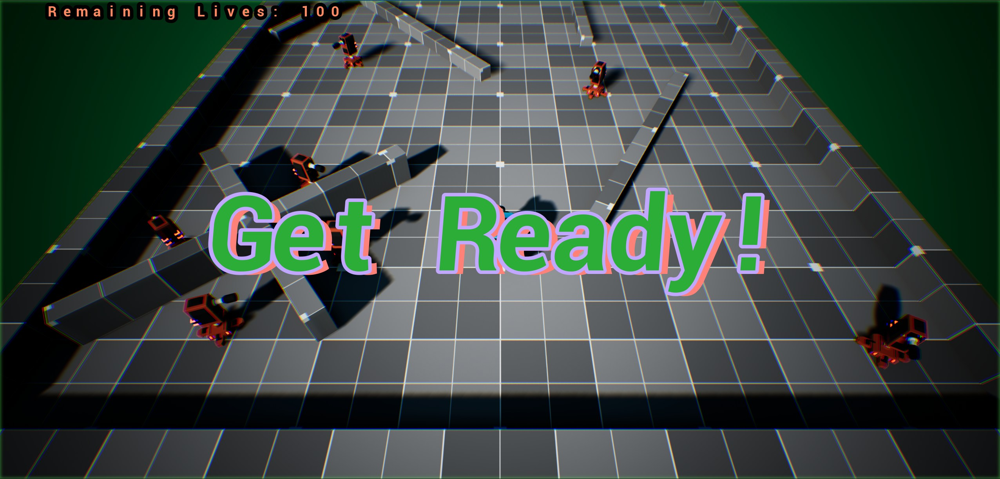
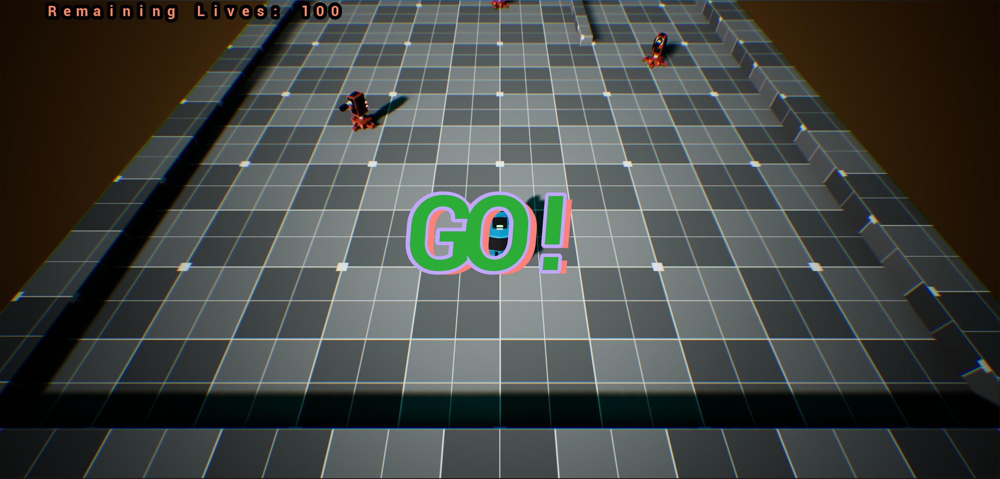
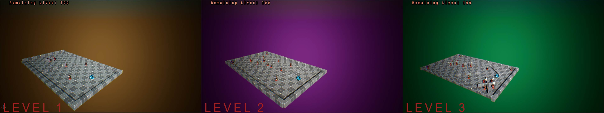
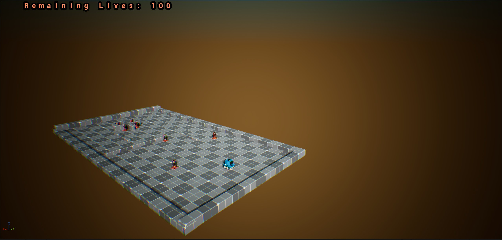
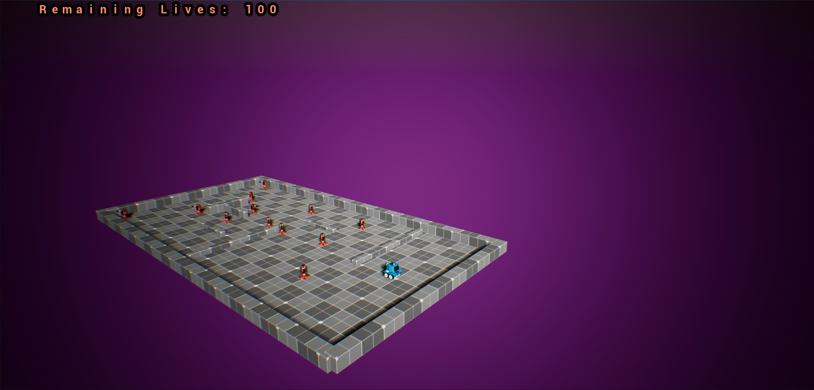
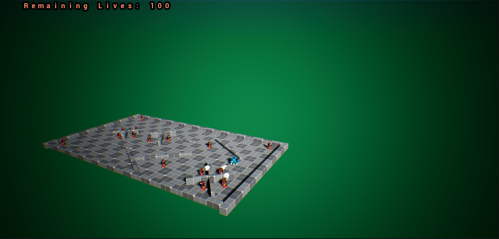

# BattleBlaster 🚀
*Move through each level to attack and avoid being attacked*

## 🎮 How to Play
The objectve of this game is to destroy all the enemy towers in each level while trying to dodge their attacks with the limited lives you have.  

### ⌨️ Controls
* **W/A/S/D**: Move and rotate the tank.
* **Mouse**: Aim Turret.
* **Left Click**: Fire.

## 🛠️ Features
* **Dynamic Enemy Tanks**: Engaging combat against multiple types of enemy classes that track and attack the player.
* **Destruction System**: Visual and mechanical impact effects that show damage on both player and enemy units.
* **Object-Oriented Programming**: Use of BasePawn class which has common functionality that the child classes, Tank and Tower, make use of. 

  
## 📸 Screenshots
## 📸 Screenshots

### Game UI

### Level Previews

